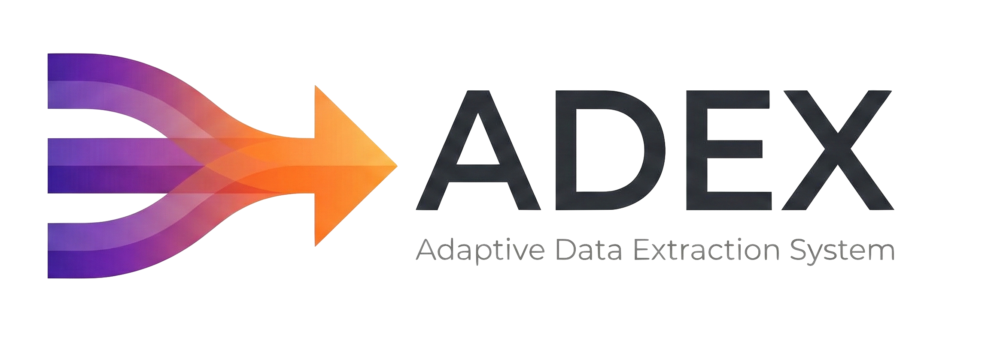

# ADEX — Adaptive Data Extraction System


**Video-first data extraction that succeeds where single-image OCR fails.**


<p align="center">
  
</p>

ADEX replaces the fragile "take one perfect photo" approach with temporal video analysis. Users record a short video sweep of a product, and ADEX extracts accurate text and structured data — even from blurry, glare-obscured, or folded surfaces.

---

## The Problem

Consumer apps that analyze packaged products — food scanners, ingredient checkers, health ratings — all rely on static image capture. This approach breaks constantly in real-world conditions:

| Issue | Why It Happens |
|-------|---------------|
| **Light reflection / glare** | Shiny plastic packaging reflects camera flash or ambient light, whiting out text |
| **Folds and creases** | Flexible packaging wrinkles, hiding portions of ingredient lists |
| **Curved surfaces** | Bottles and cans distort text at the edges, making OCR unreliable |
| **Motion blur** | Shaky hands or low-end cameras produce unusable captures |
| **Unstructured layouts** | Every product has a unique label layout — no single template works |

Apps like **Yuka**, **Truthin**, **Think Dirty**, **EWG Healthy Living**, and **Open Food Facts** all suffer from this. Users are forced to retake photos multiple times or resort to tedious manual entry when OCR fails.

---

## How ADEX Solves It

Instead of gambling on a single frame, ADEX captures a short video sweep and analyzes **dozens of frames across time**. This temporal redundancy means:

- Text hidden by glare in frame 12 is visible in frame 37
- A fold that obscures ingredients at one angle is flat at another
- Motion blur in one frame is sharp in the next

The system doesn't need any single frame to be perfect — it reconstructs complete, accurate data from the collective information across all frames.

---

## How It Works

```
┌─────────────┐     ┌──────────────────┐     ┌───────────────────┐
│  User records│     │  Server extracts │     │  AI classifies &  │
│  video sweep │────>│  frames (FFmpeg) │────>│  generates         │
│  of product  │     │  at 2 FPS        │     │  embeddings        │
└─────────────┘     └──────────────────┘     └─────────┬─────────┘
                                                        │
┌─────────────┐     ┌──────────────────┐     ┌──────────▼─────────┐
│  Structured  │     │  Gemini extracts │     │  RAG identifies    │
│  JSON data   │<────│  text from best  │<────│  best frames per   │
│  returned    │     │  frames          │     │  category          │
└─────────────┘     └──────────────────┘     └────────────────────┘
```

### Step-by-step flow

1. **Capture** — On mobile, the user opens the camera and records a short video sweep around the product. On desktop, the user uploads a video file.

2. **Frame extraction** — The server uses FFmpeg to extract frames at 2 frames per second, capturing the start and middle of each second.

3. **Embedding generation** — Each frame is sent to Google Vertex AI (`multimodalembedding@001`) to generate 1408-dimensional vector embeddings, stored in PostgreSQL with pgvector.

4. **Frame classification** — Using timeline heuristics and RAG, the system identifies frame types:
   - **Product front** (brand, name, claims)
   - **Nutrition facts** panel
   - **Ingredients list**
   - **Product back** (additional info)
   - **Barcode**

5. **Text extraction** — Google Gemini analyzes the best frames for each category and extracts structured text, handling distortions that would break traditional OCR.

6. **Result delivery** — The app displays extracted frames organized by type, structured JSON data (nutrition facts, ingredients, allergens), and the original video with timeline markers.

---

## Comparison with Existing Solutions

| Feature | Yuka / Truthin / Think Dirty | Open Food Facts | **ADEX** |
|---------|------------------------------|-----------------|----------|
| Input method | Single photo | Single photo + barcode | Video sweep |
| Handles glare | No | No | **Yes** — temporal redundancy |
| Handles folds/creases | No | No | **Yes** — multi-angle coverage |
| Unstructured layouts | Limited templates | Community-curated | **Yes** — AI-driven extraction |
| Low-end device support | Poor (needs sharp photo) | Poor | **Good** — compensates across frames |
| User effort on failure | Retake photo repeatedly | Manual entry | **Minimal** — just re-sweep |
| Data extraction | Barcode lookup + basic OCR | Barcode database | **AI-powered** multimodal analysis |
| Works without barcode | Rarely | No | **Yes** — vision-based |

---

## Tech Stack

| Layer | Technology |
|-------|-----------|
| Frontend | Flutter (iOS, Android, Web, macOS, Windows, Linux) |
| Backend | Serverpod 3.2 (Dart) |
| Database | PostgreSQL with pgvector extension |
| Cache | Redis |
| File storage | AWS S3 |
| AI embeddings | Google Vertex AI (multimodal, 1408D) |
| Text extraction | Google Gemini 2.5 Flash |
| Video processing | FFmpeg (OS-level via Dart Process API) |
| Authentication | JWT with Serverpod Auth IDP |

---

## Project Structure

```
adex/
├── adex_server/       # Dart backend — endpoints, video processing, AI integration
├── adex_client/       # Auto-generated typed client library
├── adex_flutter/      # Cross-platform Flutter app
├── SETUP.md           # How to set up and run the project
└── README.md          # This file
```

---

## Getting Started

See **[SETUP.md](SETUP.md)** for full instructions on setting up and running the project locally.

---

## Key Features

- **Video-based capture** — Record a sweep instead of taking a single photo
- **Temporal RAG** — Retrieval-Augmented Generation across video frames
- **Multi-surface reconstruction** — Handles front, back, sides in one sweep
- **Configurable extraction** — Custom prompts for what data to extract
- **Processing history** — Browse and revisit past extractions
- **Cross-platform** — Mobile camera capture and desktop file upload
- **Structured output** — JSON data with nutrition facts, ingredients, allergens
- **Rate-limit resilient** — Exponential backoff with configurable concurrency

---

## Roadmap

- **Edge-side intelligence** — On-device frame quality assessment (YOLO-based) to discard junk frames before upload
- **3D object scanning** — Full-package capture (front, back, sides) via multi-surface reconstruction
- **Community verification** — Human-in-the-loop feedback for low-confidence results
- **Developer API** — Plug-and-play API for third-party apps to replace static OCR with temporal video extraction

---

## License

Proprietary. All rights reserved.
