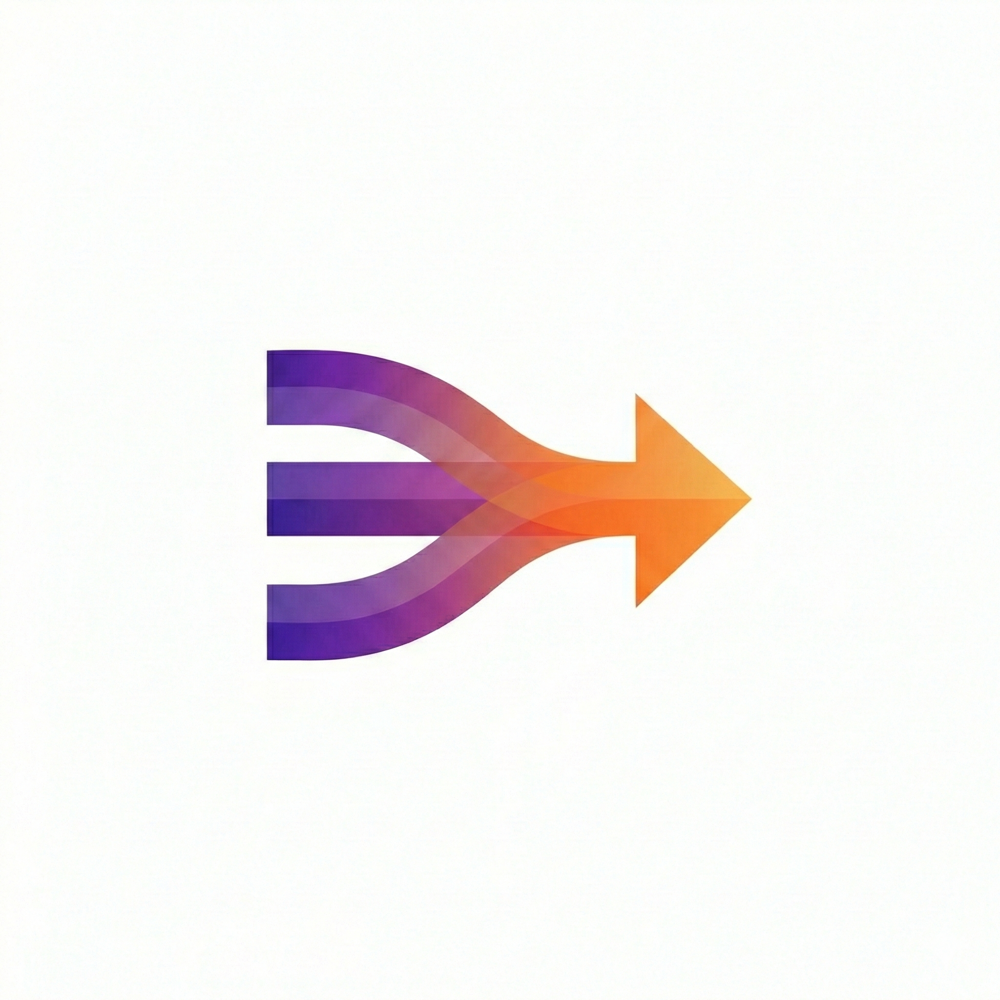

# Project ADEX — Adaptive Data Extraction System

*Solving the "Static Image Failure" with Temporal RAG*


<p align="center">
  
</p>

## Inspiration

The idea for **ADEX** was born from a recurring dead roadblock I encountered while contributing to **Truthin**, a crowdsourced platform for packaged food ratings. Users frequently submitted unusable images—blurry, out-of-focus, or obscured by glare. In many cases, reflections from shiny plastic or folds in packaging made ingredient lists unreadable, even to the human eye.

This problem extends far beyond Truthin. Industry-leading apps such as **Yuka, Think Dirty, EWG Healthy Living, Open Food Facts, MyFitnessPal, Lifesum, and Calorie Mama** still rely on static image capture. When users have shaky hands, poor lighting, or low-end devices, OCR fails—forcing repeated retakes or tedious manual entry.

The core limitations of single-image approaches:

| Issue | Why It Breaks OCR |
|-------|-------------------|
| **Light reflection / glare** | Shiny plastic packaging reflects camera flash or ambient light, whiting out text |
| **Folds and creases** | Flexible packaging wrinkles and crumples, hiding portions of ingredient lists |
| **Curved surfaces** | Bottles and cans distort text at the edges beyond recognition |
| **Motion blur** | Shaky hands or low-end cameras produce unusable captures |
| **Unstructured layouts** | Every product has a unique label layout—no single template fits all |

The breakthrough came during a **Serverpod 3.0** demo by Vik, showcasing its **Industrial RAG (Retrieval-Augmented Generation)** capabilities. I realized that by applying RAG to *video frames instead of single images*, we could triangulate accurate data from imperfect visual input over time.

---

## What It Does

ADEX replaces unreliable one-shot photography with **temporal video-based data extraction**.

Instead of asking users to take a perfect photo, the system captures a short video sweep of a product. By analyzing dozens of frames, ADEX reconstructs missing or obscured information—recovering text hidden by glare, motion blur, or physical distortion. The result is fast, accurate extraction of ingredients, nutrition facts, allergens, and any other product data with minimal user effort.

The key insight: **a single image is a gamble; a video is a guarantee.** Text hidden by glare in frame 12 is visible in frame 37. A fold that obscures ingredients at one angle is flat at another. Motion blur in one frame is sharp in the next. ADEX doesn't need any single frame to be perfect — it reconstructs complete data from the collective information across all frames.

---

## Video Text Extraction Flow

```
  User records video sweep of product
                  │
                  ▼
  ┌───────────────────────────────────┐
  │  1. Create Processing Record      │
  │     Save job to database          │
  └───────────────┬───────────────────┘
                  ▼
  ┌───────────────────────────────────┐
  │  2. Extract Frames                │
  │     FFmpeg splits video into      │
  │     frames at 2 per second        │
  └───────────────┬───────────────────┘
                  ▼
  ┌───────────────────────────────────┐
  │  3. Generate Embeddings           │
  │     Vertex AI converts each       │
  │     frame into a 1408D vector     │
  │     and stores it in pgvector     │
  └───────────────┬───────────────────┘
                  ▼
  ┌───────────────────────────────────┐
  │  4. Classify Frame Types          │
  │     Gemini decides what to        │
  │     look for (nutrition facts,    │
  │     ingredients, product front)   │
  └───────────────┬───────────────────┘
                  ▼
  ┌───────────────────────────────────┐
  │  5. RAG: Find Best Frames        │
  │     Cosine similarity search      │
  │     matches text descriptions     │
  │     to frame embeddings           │
  └───────────────┬───────────────────┘
                  ▼
  ┌───────────────────────────────────┐
  │  6. Extract Text (optional)       │
  │     Gemini reads all best frames  │
  │     in one call and returns       │
  │     structured JSON data          │
  └───────────────┬───────────────────┘
                  ▼
  ┌───────────────────────────────────┐
  │  7. Cleanup & Return              │
  │     Delete temp data, mark done,  │
  │     return extracted results      │
  └───────────────────────────────────┘
```

### User-Configurable Parameters

The extraction pipeline is fully configurable from the app's settings:

| Parameter | Default | Purpose |
|-----------|---------|---------|
| **userPrompt** | — | What to extract (e.g., "Extract all nutrition and ingredient data") |
| **whatDoesThisVideoContain** | — | Video description to guide frame classification |
| **suggestFramesToExtract** | — | Hint frame types (e.g., `["nutrition_facts", "ingredients"]`) |
| **extractToText** | `false` | Enable Gemini text extraction from best frames |
| **extractedDataInformationPrompt** | — | Detailed instructions for text extraction |
| **concurrency** | `5` | Parallel API calls per batch |
| **delayBetweenBatchesMs** | `200` | Delay between batches to manage rate limits |
| **maxRetries** | `5` | Retry count with exponential backoff |

---

## How We Built It

### Backend — Serverpod 3 (Dart)
Built on **Serverpod 3.2**, leveraging its native vector embedding support via pgvector and typed endpoint generation. The server handles video processing, AI orchestration, S3 storage, and JWT authentication — all in Dart.

### Video Processing — FFmpeg
Integrated **FFmpeg** invoked at the OS level using Dart's `Process` API to extract frames at 2 FPS. Each video produces dozens of frames that form the input to the RAG pipeline.

### Multimodal Temporal RAG
The core innovation. Each frame is converted to a 1408-dimensional vector embedding using **Vertex AI multimodalembedding@001**. Frame type descriptions are converted to text embeddings in the same vector space. **PostgreSQL with pgvector** performs cosine similarity search to find the frames that best match each category — this is the retrieval step of RAG. **Gemini 2.0 Flash** then performs the generation step, extracting structured text from the retrieved frames.

### Cloud Storage — AWS S3
Videos and extracted frames are stored in **AWS S3** (eu-north-1). The pipeline saves video bytes locally for processing and uploads to S3 asynchronously in the background to avoid round-trip latency.

### Frontend — Flutter
A cross-platform **Flutter** app with platform-adaptive UI:
- **Mobile**: Full-screen camera with record button, settings sheet for prompts and performance tuning, processing progress view, and tabbed results display
- **Desktop/Web**: File picker for video upload, responsive two-pane layout, model browsing, and JSON data viewer

### Authentication — JWT with Email Verification
**Serverpod Auth IDP** provides JWT-based authentication with email identity provider, email verification codes, and password reset flow via **Gmail SMTP**.

---

## Challenges We Ran Into

- **Optical Distortions:**
  Packaging is often curved, glossy, or crinkled. Ensuring the AI recognized distorted text across multiple angles as the same semantic entity required careful embedding tuning. The multimodal embedding model handles this by encoding visual semantics rather than raw pixels.

- **Rate Limiting at Scale:**
  Processing a single video generates dozens of frames, each requiring an embedding API call. We implemented configurable batch concurrency (default 5 parallel calls), delays between batches (200ms), and exponential backoff with jitter — capped at 60 seconds — to handle 429 and RESOURCE_EXHAUSTED errors gracefully.

- **Single-Call Text Extraction:**
  Initially we called Gemini per frame type, but this hit rate limits fast and lost cross-frame context. We refactored to send ALL extracted frames to Gemini in a **single multimodal API call**, which is both faster and more accurate since Gemini can cross-reference information across images.

- **FFmpeg & Dart Ecosystem Gaps:**
  FFmpeg lacks a robust native Dart package for frame extraction. As a workaround, we invoked **FFmpeg directly at the OS level** using Dart's `Process` API, enabling reliable frame slicing while preserving performance.

- **Upload Latency:**
  High-resolution video uploads are expensive. We eliminated the S3 round-trip by saving video bytes locally for immediate processing and uploading to S3 **asynchronously in the background** using Dart's `unawaited()`.

---

## Accomplishments That We're Proud Of

- Successfully replaced fragile static OCR with a **video-first temporal extraction pipeline**.
- Achieved high accuracy even on **low-end devices** and poor lighting conditions.
- Built a production-grade **multimodal RAG system** in Dart — vector embeddings, cosine similarity search, and AI-powered text extraction.
- **Single API call** text extraction across all frame types, avoiding rate limits and improving accuracy.
- Reduced user friction by shifting accuracy responsibility from the user to the system — no more retaking photos.
- Cross-platform support from a **single Flutter codebase** — mobile camera capture and desktop file upload.

---

## What We Learned

The biggest insight was the power of **temporal redundancy**. A single image is a gamble; a video is a guarantee.

We learned how to use software intelligence to overcome hardware constraints — proving that you don't need a $1,200 phone camera when you can reason over imperfect frames from a $100 device. The project also deepened our expertise in:

- Real-time AI pipelines and multimodal embeddings
- Vector databases (pgvector) and similarity search
- Rate limit management with exponential backoff at scale
- Asynchronous cloud storage patterns
- Scalable RAG systems within the **Serverpod ecosystem**

---

## What's Next for ADEX

- **Phase 1: Edge-Side Intelligence**
  Integrate **YOLO-based on-device models** to perform real-time frame quality assessment, discarding junk frames locally before upload — reducing bandwidth and processing cost.

- **Phase 2: Multi-Surface Reconstruction**
  Extend temporal RAG to handle **3D object scans**, allowing full-package capture (front, back, and sides) in a single video sweep with spatial awareness.

- **Phase 3: Human-in-the-Loop Feedback**
  Introduce community verification for low-confidence results, creating a feedback loop that continuously improves embedding quality and extraction accuracy.

- **Phase 4: Developer API**
  Package ADEX as a **plug-and-play API**, enabling third-party apps like Yuka, Truthin, or Open Food Facts to replace static OCR with temporal video extraction.

<p align="center">
  
</p>